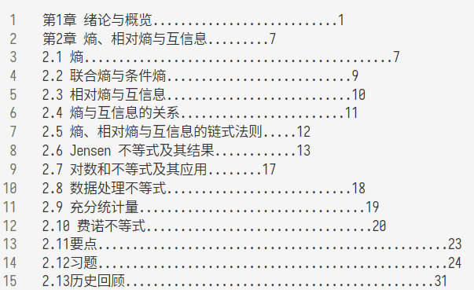

# TOCs

部分的 PDF 文档的目录，根据 ABBYY 以及 Acrobat 的 OCR 结果得到目录，并添加进 PDF 中

## 过程

首先根据 ABBYY 或者 Acrobat 对 PDF 的目录进行 OCR，得到如下图所示的格式的目录



然后使用 `parser.py` 对 OCR 得到的目录进行处理

目录的匹配规则如下，如果中途出错需要对 OCR 得到的目录进行调整

```py
match_secion = re.compile(r'(第\d+章)(.*?)[.⋯]*(\d+)$')
match_subsection = re.compile(r'(\d{1,2}\.\d{1,2}(\.\d)?)(.*?)[.⋯]*(\d+)$')
match_attachments = re.compile(r'(附录\w|参考文献|索引)(.*?)[.⋯]*(\d+)$')
```

之后将得到的处理好的目录使用 [pdf-bookmark](https://github.com/ifnoelse/pdf-bookmark) 插入到 PDF 中

## 附录

在 `toc` 下有处理过的基本上过的课程的目录
